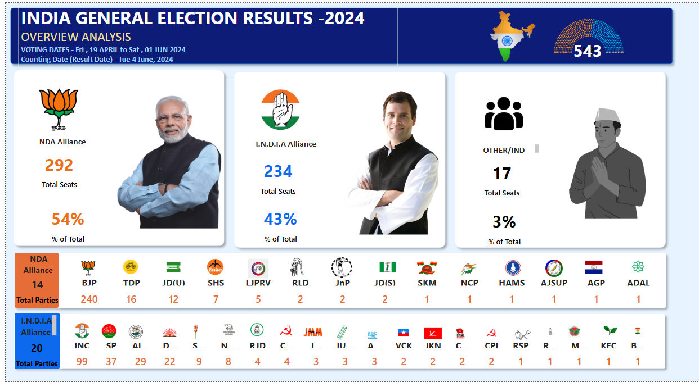

# india-election-results-2024-dashboard
Power BI dashboard analyzing 2024 Indian General Election results using SQL, Excel, and DAX

# 🇮🇳 India General Election Results 2024 - Power BI Dashboard

An interactive **Power BI dashboard** built to visualize and analyze the **2024 Indian General Election Results**. This project demonstrates real-world application of **data analytics**, **data cleaning**, **SQL**, and **DAX** with a focus on **data storytelling and visualization clarity**.

---

## 📌 Project Summary

This dashboard provides a clean, visual summary of:

- 🏛️ **Seat distribution** by alliance: NDA, I.N.D.I.A, and Others
- 🧩 **Party-wise seat count** breakdown
- 📊 **Percentage of total seats won** by each alliance
- ⚙️ Clear and minimal layout designed for quick insights

---

## 🛠 Tools & Technologies Used

| Tool / Skill       | Purpose                                 |
|--------------------|------------------------------------------|
| Excel              | Raw data cleaning & pre-processing       |
| SQL                | Querying structured data for modeling    |
| Power BI           | Visualization & dashboard development    |
| DAX                | Creating custom measures & logic         |
| Data Modeling      | Structuring relationships across tables  |

---

## 🧠 Key Metrics Tracked

- **Total Seats**: 543
- **NDA**: 292 seats (54%)
- **I.N.D.I.A**: 234 seats (43%)
- **Others**: 17 seats (3%)

---

## 📸 Dashboard Preview

---
## 📂 Repository Structure
India Election-Dashboard 2024/
│
├── India-Election-Dashboard 2024.pbix # Power BI dashboard file
├── data/
│ ├── CSV Files.csv # Raw dataset
│ └── cleaned_data.xlsx # Cleaned & processed data
├── Party Alliannce DAX/
│ └── #DAX Queries
├── images/
│ └── election-results-dashboard.png # Dashboard image preview
└── README.md # Project documentation

## 🔍 Features

- Responsive layout with **color-coded alliance blocks**
- Embedded **DAX measures** for dynamic seat counts and % calculations
- Used **data modeling** to combine cleaned tables and party metadata
- **Real-world dataset** to simulate an analyst's workflow

---

## 🚀 How to Use

1. Clone or download this repository
2. Open `India_Election_Results_2024.pbix` in **Power BI Desktop**
3. Explore and filter dashboard visuals interactively

---

## 🏷️ Tags

`#PowerBI` `#DataAnalytics` `#SQL` `#DAX` `#Excel`  
`#DataVisualization` `#DashboardDesign` `#IndianElections` `#DataStorytelling`
